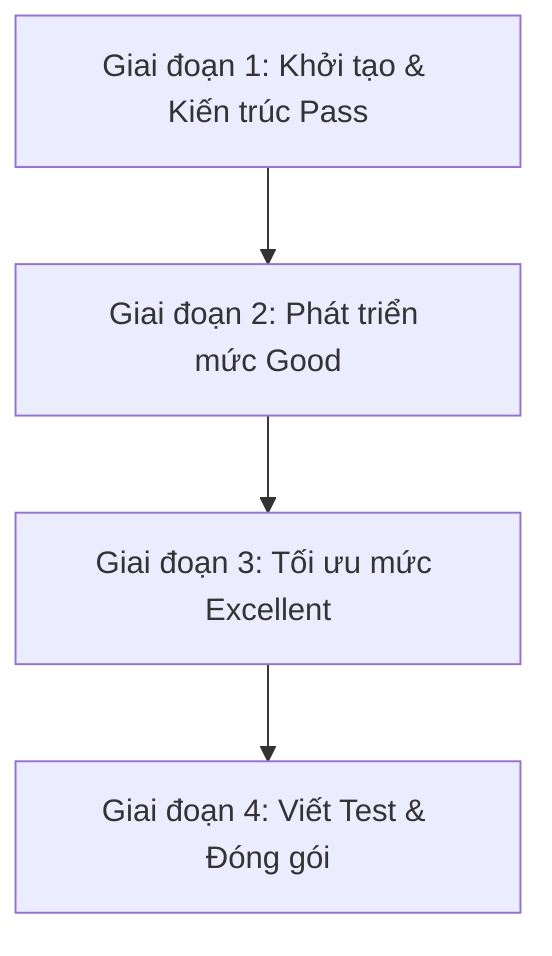

# Kế hoạch thực hiện dự án "StockPilot" Inventory & Order Management System

Dự án này là xây dựng một ứng dụng Java SE console (CLI) quản lý kho hàng và đơn hàng tên là **StockPilot** sử dụng Maven, lưu trữ dữ liệu thông qua JDBC (sử dụng H2 database chế độ file), hỗ trợ lập báo cáo bằng Stream API, nhập xuất file CSV/Text, xử lý bất đồng bộ/đồng thời cho chức năng Flash Sale, và viết Unit Test với JUnit 5.

## Đề xuất Workspace
Chúng tôi đề xuất tạo dự án tại thư mục: `C:\Users\PC\.gemini\antigravity-ide\scratch\stockpilot`
> [!IMPORTANT]
> Bạn nên thiết lập thư mục này làm không gian làm việc (workspace) đang hoạt động trong IDE của mình để dễ dàng thực thi lệnh Maven và chạy code.

---

## Các Giai đoạn Thực hiện (Phân chia theo điểm số)



### Giai đoạn 1: Khởi tạo dự án & Đạt mức Pass (Foundation)
Mục tiêu là xây dựng khung ứng dụng chạy được end-to-end, lưu trữ được dữ liệu vào DB và CLI không crash.

1. **Khởi tạo Maven Project**:
   - Tạo cấu trúc thư mục chuẩn theo yêu cầu đề bài.
   - Thiết lập `pom.xml` với các thư viện: H2 database driver, JUnit 5, SLF4J/Logback (nếu cần).
   - Thiết lập Maven compiler (Java 17+) và plugin build jar tự chạy (`maven-shade-plugin` hoặc `maven-assembly-plugin`).

2. **Thiết kế Database Schema (`schema.sql`)**:
   - Tạo các bảng: `products`, `customers`, `orders`, `order_items`.
   - Thiết lập mối quan hệ khóa ngoại (Foreign Key).

3. **Xây dựng Domain Models (`com.stockpilot.model`)**:
   - `Product`, `Customer`, `Order`, `OrderItem`.
   - Áp dụng đóng gói (Encapsulation), kiểm tra dữ liệu đầu vào trong constructor.
   - Override các phương thức `toString()`, `equals()`, `hashCode()`.

4. **Xây dựng Lớp Repository (`com.stockpilot.repository`)**:
   - Định nghĩa generic interface `Repository<T, ID>`.
   - Thực thi JDBC trong `ProductRepository` và `CustomerRepository` sử dụng `PreparedStatement` và try-with-resources để tự động đóng Connection/Statement/ResultSet.
   - Thực hiện validation SKU bằng Regex (ví dụ: `^[A-Z]{3}-\d{4}$`), validation Email/Phone.

5. **Xây dựng CLI Menu (`Main.java`) & Service cơ bản**:
   - CLI tương tác cho phép Thêm, Sửa, Xóa, Liệt kê sản phẩm và khách hàng.
   - Cơ chế bắt lỗi bằng các Custom Exception (`ProductNotFoundException`, `InvalidInputException`, v.v.) để chương trình CLI không bao giờ crash khi gặp lỗi.

---

### Giai đoạn 2: Phát triển các tính năng mức Good (Intermediate)
Mục tiêu là tích hợp Transaction, Stream API và File I/O.

1. **Quản lý Đơn hàng & Transaction**:
   - Lưu trữ giỏ hàng bằng `Map<String, Integer>` (SKU -> Số lượng) trong CLI.
   - Khi Checkout (Thanh toán): Sử dụng **JDBC Transaction** (`connection.setAutoCommit(false)`). Thực hiện kiểm tra tồn kho, giảm số lượng tồn kho của từng sản phẩm, lưu đơn hàng và chi tiết đơn hàng. Nếu có bất kỳ lỗi nào (như `InsufficientStockException`), thực hiện `rollback()`.
   - Thiết kế Interface/Abstract class `DiscountPolicy` với các lớp con `NoDiscount`, `PercentageDiscount`, `BulkDiscount` để tính giá linh hoạt (Polymorphism).
   - Dùng `@FunctionalInterface PricingRule` cho các quy tắc tính giá tùy biến.

2. **Báo cáo và Phân tích (Stream API)**:
   - Viết các service lấy dữ liệu từ DB lên dạng Collection, sau đó sử dụng Stream API để tính toán:
     - Tổng doanh thu và số lượng đơn hàng theo khoảng thời gian.
     - Top-N sản phẩm bán chạy nhất (`sorted()`, `limit()`).
     - Doanh thu theo danh mục sản phẩm (`Collectors.groupingBy`).
     - Danh sách sản phẩm sắp hết hàng (Low-stock).

3. **Nhập xuất File (File I/O & CSV)**:
   - Import danh sách sản phẩm từ file CSV (sử dụng String/Regex để parse thủ công).
   - Export hóa đơn (Invoice) và các báo cáo ra file text trong thư mục `output/`.

---

### Giai đoạn 3: Tối ưu các tính năng mức Excellent (Advanced)
Mục tiêu đạt điểm tối đa nhờ xử lý đồng thời, tối ưu kiểu dữ liệu và nâng cao chất lượng code.

1. **Xử lý Concurrent Đơn hàng (Flash Sale Simulation)**:
   - Mô phỏng N luồng đồng thời mua cùng 1 sản phẩm giới hạn tồn kho thông qua `ExecutorService`.
   - Áp dụng cơ chế đồng bộ hóa tránh Over-selling (bán quá số lượng tồn kho): Sử dụng `synchronized`, `ReentrantLock` ở mức Java Code, hoặc Row Locking (`SELECT ... FOR UPDATE`) trong Database Transaction.
   - Viết tài liệu phân tích ngắn về hiện tượng Race Condition xảy ra khi không đồng bộ hóa và cách giải quyết.

2. **Tính năng nâng cao**:
   - Sử dụng kiểu dữ liệu `BigDecimal` cho tất cả các phần tính toán tiền tệ để tránh sai số dấu phẩy động.
   - Tạo một **background thread** định kỳ ghi file snapshot của báo cáo doanh thu trên một schedule định trước, kèm theo cơ chế Graceful Shutdown an toàn.

---

### Giai đoạn 4: Viết Test, Tài liệu & Đóng gói

1. **Unit Testing (`com.stockpilot`)**:
   - Viết ít nhất 8 test cases có ý nghĩa sử dụng JUnit 5.
   - Test các logic tính toán chiết khấu, ném ra ngoại lệ `InsufficientStockException`, báo cáo doanh thu, v.v.

2. **README & Đóng gói**:
   - Viết file `README.md` hướng dẫn cấu hình DB, cách cài đặt, chạy ứng dụng, mô tả Database Schema, tài liệu phân tích Race Condition và bảng checklist tính năng.
   - Đóng gói dự án thành file runnable JAR chạy được độc lập.

---

## Kế hoạch Cấu trúc Thư mục Chi tiết
```
stockpilot/
├── pom.xml
├── schema.sql
├── products.csv
├── README.md
└── src/
    ├── main/
    │   ├── java/com/stockpilot/
    │   │   ├── Main.java
    │   │   ├── model/           # Product.java, Customer.java, Order.java, OrderItem.java, ...
    │   │   ├── repository/      # Repository.java, ProductRepository.java, OrderRepository.java, ...
    │   │   ├── service/         # ProductService.java, OrderService.java, DiscountPolicy.java, ...
    │   │   ├── exception/       # Custom Exceptions
    │   │   ├── io/              # CSVImporter.java, InvoiceExporter.java
    │   │   ├── concurrent/      # FlashSaleSimulator.java, SnapshotScheduler.java
    │   │   └── util/            # DatabaseConnection.java, InputValidator.java
    │   └── resources/
    │       └── db.properties    # Cấu hình H2 Connection
    └── test/
        └── java/com/stockpilot/ # Các JUnit 5 test cases
```

---

## Kế hoạch kiểm thử (Verification Plan)

### Kiểm thử tự động (Automated Tests)
- Chạy lệnh: `mvn clean test` để kiểm tra toàn bộ 8+ JUnit tests.

### Kiểm thử thủ công (Manual Verification)
- Khởi động ứng dụng CLI, nhập các lựa chọn từ Menu:
  - Import sản phẩm từ file CSV thành công.
  - Đặt hàng vượt quá số lượng tồn kho xem có ném lỗi chính xác và rollback transaction hay không.
  - Xem báo cáo doanh thu và so sánh dữ liệu với database.
  - Chạy mô phỏng Flash Sale đồng thời để verify số lượng tồn kho cuối cùng luôn chính xác và không bị âm.
